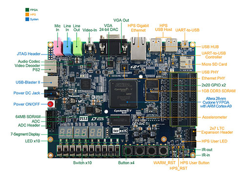

# Development Kit Hardware Guide

This guide will step through the process of loading a compiled project onto the [DE1-SoC Development Board](https://github.com/CWRU-EECS301-S18/syllabus/blob/master/Reference/DE1-SoC/README.md).

## ESD Concerns

Electrostatic discharge ([ESD](https://en.wikipedia.org/wiki/Electrostatic_discharge)) can be very destructive to electronic devices, especially devices not housed in protective enclosures like the development boards used for this lab.

ESD Guidelines:

* Always touch the metal plate attached to the bottom of the DE1-SoC development board first as this is tied to the ground of the PCB itself.  This will keep the dev board safe, but if you have the USB connection plugged in, the ESD charge will use it as a path back to earth ground possibly damaging the USB port.  Use common sense when dealing with ESD - you want to harmlessly discharge it to an earth ground first and not to the electronics. 

Additional reference reading: 

* [The Prevention and Control of Electrostatic Discharge](https://www.minicircuits.com/app/AN40-005.pdf)

## Verify the Project Board Configuration

:warning: **WARNING:** Before programming the development board, **double-check** that the project has been built with the correct pin assignments.

The following **Critical Warning** compilation message indicates that the pin location assignments are missing:

	Critical Warning (169085): No exact pin location assignment(s) for 57 pins of 57 total pins. For the list of pins please refer to the I/O Assignment Warnings table in the fitter report.

If you get this message, then go back to the [Import the FPGA Pin Assignments](QuartusProject-Guide.md#import-the-fpga-pin-assignments) section and reapply the assignments by reloading the pins file.

## Netlist Generation

The last step of the compilation process, **EDA Netlist Writer**, generates an **SRAM Object File** (.sof) in the `output_files` directory.  For Lab 1, this file is called `EECS301_Lab1_TopLevel.sof`.  

The **sof** file can be used to directly configure the logic SRAM cells of the FPGA fabric using the **Quartus Programmer**.  The logic SRAM cells are volatile so the **sof** image remains in the FPGA fabric only until power is removed or the FPGA is reset.  

:information_source: Some FPGAs have internal non-volatile memory but most still require an external memory to store the FPGA image.  At power-up (or reset) the FPGA loads the logic SRAM cells from the image stored in the non-volatile memory device.  Quartus generates a Programmer Object File (.pof) which can be used to load the non-volatile memory device.

**NOTE:** For all labs, only the **sof** images will be used so you must reload your project after cycling power.

The following message will appear near the end of the compilation messages if the netlist was generated without errors.

	Info: Quartus Prime EDA Netlist Writer was successful. 0 errors, 0 warnings

## Development Board Setup

The following image labels all the connectors on the DE1-SoC Board:

Most importantly, the **Power DC Jack** and the **USB-Blaster II** connectors on the left-side of the board next to the red **Power Button**.  Included in the box with the development board are a 12V power supply and a USB A to USB B cable.  These will need to hook up for all labs. 

The development kit box will have the DE1-SoC Development Board, power supply and USB cables.  For the first lab you only need to connect the power and the USB cable to the USB-Blaster port.

**WARNING:** The lab computers have two sets of USB ports on the front panel.  One set is USB 2.0 and the other USB 3.0.  When connecting the **USB-Blaster** cable, use the USB 2.0 ports because some of the lab computer have connectivity issues with the USB 3.0 ports.

## Quartus Programmer

1. From **Quartus**, launch the **Programmer** from the **Tasks** panel (with **Compilation** flow selected) by double-clicking **Program Device (Open Programmer)**:

	

1. The **Quartus Programmer** window will open:

	

1. If the textbox next to the **Hardware Setup** button says `No Hardware` then you'll need to select the programming hardware setup in the next section ([Connecting USB Blaster](#connecting-usb-blaster)).  Otherwise, skip to the [Configure Device Chain](#configure-device-chain) section.

### Connecting USB Blaster

The DE1-SoC Development Board has a built-in **USB-Blaster II** Download Cable.  The USB Type-B connector for the **USB-Blaster II** can be found on the left-hand side of the board in the following image:

On Windows, the USB Blaster Device driver must be installed (which should have occurred during the Quartus install).

On Linux, you'll need the Device driver plus you may have to modify a configuration file.  See the Linux Setup Guide.

**Connection Steps:**

1. Using the standard USB A to B cable, included in Development Kit, connect your computer to the **USB-Blaster II** connector on the development board. 

1. Make sure the development board power is turned on.

1.	In the **Quartus Programmer** window, click the `Hardware Setup...` button to select the USB Blaster hardware.  

	If connected properly, the DE1-SoC board will show up as **DE-SoC** on port **USB-1**. 

	:warning: If the **DE-SoC** option does not show up, check that the board is connected, powered on, and that the device drivers are installed properly.

	

1. Select **DE-SoC [USB-1]** in the **Currently selected hardware** drop-down list.

1. Click the **Close** button to save the changes then go to the [Configure Device Chain](#configure-device-chain) section.

### Configure Device Chain

The **USB Blaster** can automatically detect what parts are on the JTAG chain (in most cases).  

1. Make sure the board power is turned on and click the **Auto Detect** button (left-hand side of the Programmer window).

1. The **Select Device** dialog should appear since the Cyclone V FPGA used has multiple variations.  Select the **5CSEMA5** option (second in the list).

	

	:warning: If the **Select Device** dialog does ***not*** appear, make sure you have the board power turned on.

1. Click the **OK** button to run the scan.

	:warning: If Quartus loaded a default device list, you may see a warning message that the _Programmer's device list_ does not match the _auto-detected device chain_.  In most cases, it is OK to overwrite the settings so click the **Yes** button.
	
	
	
	The detection scan should have found two devices: **SOCVHPS** (the ARM CPU) and **5CSEMA5F31** (the FPGA).  For this class, only the **5CSEMA5F31** device will be used.

	

### Setting the Image

1. To set the programming image, first click on the **5CSEMA5** chip icon, then right-click on the icon to bring up the device menu (this is weird but if the icon is not selected first then the options are grayed out).  

1. From the menu select **Edit** -> **Change File** to bring up the **Select New Programming File** dialog.

	

1. Verify the **Select New Programming File** dialog started in the right project directory (sometime its not in the active project).

1.  Select the file `\output_files\EECS301_Lab1_TopLevel.sof`.

	:warning: **WARNING:** Make sure you are in the right project directory. Sometimes Quartus Programmer will open the file selector in a previously opened location, which could be a different project.

	

1. Click **Open** after selecting the correct file.

	**NOTE:** The file name for the **5CSEMA5F31** device will be updated in the upper pane of the Programmer window.  

### Program the FPGA

1. Enable the **Program/Configure** check-box of the **5CSEMA5F31** device in the upper pane of the Programmer Window (this sets the action that will take place when the programmer is run).

	

1. Now, click the **Start** button to start the programming process.

	The progress bar will indicate the programmer is running and should return a successful message when complete.

	

	:warning: If an error occurs, first double-check the board is powered-on. Then go back through the configuration steps to make sure all the correct options were set.

	:warning: If the LEDs are dimly lit after programming, there may be a problem with the pin assignments.  **Turn the board off** then double-check the Pin Planner for missing pin assignments.  Recompile then try loading again.
	
### Program Changes and Reprogramming

Quartus will allow you to make code changes and recompile while the Programmer Window is open.  The programmer files will automatically update so just click **Start** again after compiling to load the new image.

### Save the Programmer Configuration

The Quartus Programmer configuration can be saved to a **.cdf** file.  Saving the configuration will make the setup faster the next time you use the programmer.

---

Return to the [Lab 1 Quartus Project Guide](QuartusProject-Guide.md#load-the-project-on-the-development-board) page...
