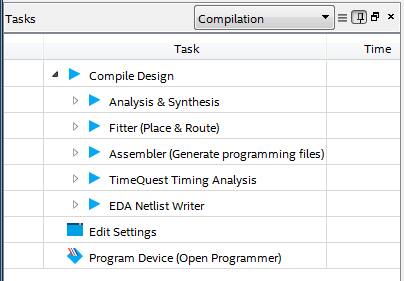
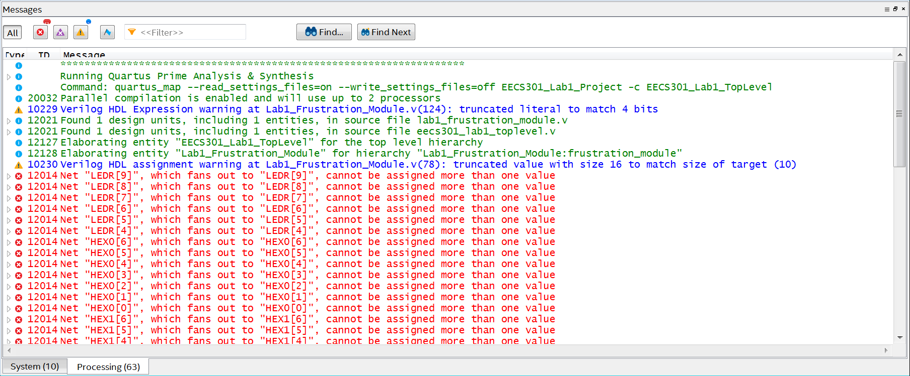

# Frustration Lab

The framework code used in the [Quartus Tutorial](QuartusProject-Guide.md) implemented a simple design to light up some LEDs when pushing buttons.  The code was error free so the compilation process was easy (hopefully).  In the next part of the lab, another framework module will be added to the design, except the new module code has numerous bugs. The goal will be to fix the problems and in the process see some of the more common (and confusing) Quartus error messages.

## Assignment Step Overview

* Add the Frustration Module to the design.
* Error Debugging Walkthrough (iteratively compile and fix bugs)
* Load the error-free image on the Development board
* Test the new button press functionality

## Lab System Architecture


## Frustration Module Instantiation

The **Lab1\_Frustration\_Module** was included with the framework code in the file `Lab1_Frustration_Module.v`.  This module, which has numerous bugs, will be added to the project and used to demonstrate common compiler issues. 

FPGA designs are hierarchical and, by convention, the top most module in the design will be called the **Top Level** module.  For the Lab 1 Project this module is called **EECS301\_Lab1\_TopLevel**.  Modules and hierarchical design will be covered more in the next lab.  For now, we simply need to uncomment the module instantiation already provided in the top level module, then start the debugging process.

### Assignment Steps:

1. If not already open, open the Lab 1 Project (the project file is named `EECS301_Lab1_TopLevel.qsf`) which was created during the Quartus Tutorial.

	:warning: **WARNING:** Make sure to use **Open Project...** instead of **Open...** from the **File** menu.  **Open** will open just the file whereas **Open Project** loads the entire project.

1. Add the `Lab1_Frustration_Module.v` to the project by selecting the **Project** -> **Add/Remove Files in Project...**

	Use the `...` button to open the file browser and select the `Lab1_Frustration_Module.v` file.  
	
	You should see the file added to the file list.
	
	


2. On the left-hand side of the Quartus window, the Project Navigator panel will show all the modules and files in the project.  Open the top level module by double-clicking on the module name, **EECS301\_Lab1\_TopLevel**, in the navigator panel Hierarchy view.

	**NOTE:** The Project Navigator panel has a drop-down menu to switch between viewing the project module Hierarchy and the Project Files.
	
	
	
	**WARNING:** The Project Hierarchy is only updated after compiling the project so you may not see your changes right away.  Switching to the **Project Files** view is usually easier in the early stages of a project when the module structure is in flux.

3. In the **EECS301\_Lab1\_TopLevel** editor window, scroll down to see the commented-out **Lab1\_Frustration\_Module** instantiation.

	```verilog
		//
		// Lab 1 Frustration Module
		//
	
	//	Lab1_Frustration_Module frustration_module
	//	(
	//		// LED Signals
	//		.LEDR( LEDR ),
	//
	//		// HEX LED Display Signals (Active-Low)
	//		.HEX0( HEX0 ), // HEX LED Disp 0
	//		.HEX1( HEX1 ), // HEX LED Disp 1
	//		.HEX2( HEX2 ), // HEX LED Disp 2
	//		.HEX3( HEX3 ), // HEX LED Disp 3
	//		.HEX4( HEX4 ), // HEX LED Disp 4
	//		.HEX5( HEX5 ), // HEX LED Disp 5
	//	
	//		// Key Button Signals (Active-Low)
	//		.KEY( key_sync_reg ),
	//
	//		// Clock Signal
	//		.CLOCK_50( CLOCK_50 )
	//	);
	```

	**NOTE:** Verilog uses C-style comments: `//` to comment the remaining line and ``/* */`` to comment a section. Note that each line is commented here instead of using the block comment syntax.  Commenting this way makes it easier to see block changes in the Git difference reports since the change is shown as a single change for the full block instead of one change at the start of the block and another at the end.

4. Remove the comment `//` from the beginning of each line of the module instantiation to enable the module.  

	**NOTE:** The _"Lab 1 Frustration Module"_ comment should be left commented, this is a section separator to make the code easier to read through.

	**NOTE:** The Quartus editor allows block selections by holding the **Alt** key while selecting the block with the mouse.

5. Save the file by either selecting **File** -> **Save** from the menu, clicking the **Save** icon on the toolbar, or using the key command **Ctrl+s**.

You are now ready to start the debugging walkthrough.

## Debugging Walkthrough

Resolving errors in Quartus is an iterative process.  Many times one error will cascade many other error or warning messages.  Fixing the first error clears up the others so when looking at the Compilation Messages only focus on the first problem then try to recompile.  It is not fun trying to find phantom errors. 

**WARNING:** The following steps will walkthrough the error messages in an assumed order.  Hopefully the order of messages presented matches the order of errors given by Quartus.  You may have to jump around if Quartus ends up compiling in a different order for some reason.

### Assignment Steps:

1. In the **Tasks** panel, make sure the design flow drop-down is set to **Compilation**.

1. The compilation process is going to be run a number of times.  To save some time, instead of running the full compilation every time, run just the **Analysis & Synthesis** phase (which is first) until no errors are thrown. 
	
	The **Analysis & Synthesis** process can be run by expanding the **Compile Design** line and double-clicking on the **Analysis & Synthesis** line.
	
	

	**WARNING:** Compilation process should not take longer than 2 minutes for any of the steps in this lab.  If it does then you probably have an issue with the tools or the machine so ask for help.
	
1. The compiler should error out pretty quick for this first pass with the following error:

	:warning: If the **Messages** window is not visible, click **Alt+3** to show it.  Windows can also be turned on and off from the menubar by selecting **View** -> **Utility Windows**.

	

	Double-clicking on the error will take you to the code line where the compiler thinks the problem is, line 37 in this case.
	
	
	
	The error description is "expecting a direction".  The actual problem is the comma after CLOCK_50 on line 36 (obviously right?).  Each line in a module port definition is terminated with a comma, except for the last port in the block.
	
	**To fix the problem:**  Remove the comma after CLOCK_50 on line 36, save, then rerun the _Analysis & Synthesis_ process.

1. The next error the compiler throws should be the following:

	

	Forgetting to terminate a line with a semicolon is a more common error and the compiler message is clearer about the problem, except the line called out in the error message is line 46, but the actual line missing the semicolon is line 37.  This is usually the case with this message, look to the previous line for the missing termination.

	**To fix the problem:** Add a semicolon to the end of line 37 to closeout the module port definition, save, then rerun the _Analysis & Synthesis_ process.


1. For the next set of errors, if you get the warning shown below in blue, then you forgot to include the code file as part of the project.  Go back to Step 2 of the [previous section](#frustration-module-instantiation) to add the `Lab1_Frustration_Module.v` file to the project.  Take note of this warning because you may see it in later labs when the included frameworks have many files.

	

	For the error messages, these are two common errors that occur due to using the wrong _net type_ for a signal.  In Verilog, the two most common net types are **wire** and **reg**.  A **wire** is a continuous signal assignment that must be assigned outside a process block.  A **reg** can be either continuous or registered but must be assigned within a process block.
	
	For the first error, the message says **key0_value** must have a "net type" which means it should be a **wire**.  The definition for **key0_value** on line 47 is **reg** instead of **wire**.
	
	The second error message is the opposite, the message says **key_value** must have a "variable data type" which means it should be a **reg**.  The definition for **key_value** on line 46 is **wire** instead of **reg**.
	
	**NOTE:** Take a look at how both signals are being assigned to see the difference between using a **wire** signal vs a **reg** signal.  There will be more on this in the next lab.
	
	**To fix the problem:** Change the definition for **key0_value**, line 47, from **reg** to **wire** and change the definition for **key_value**, line 46, from **wire** to **reg**.  
	
	Save and rerun the _Analysis & Synthesis_ process.

1. When the _Analysis & Synthesis_ process finishes, there will be a lot of errors listed in the **Messages** window (you may need to scroll to the top of the window).

	
	
	For now, skip the blue warning messages.  We'll come back to those later.
	
	For the big list of errors, the same error is occurring for multiple signals.
	
	```
	Error (12014): Net "LEDR[9]", which fans out to "LEDR[9]", cannot be assigned more than one value
		Error (12015): Net is fed by "GND"
		Error (12015): Net is fed by "Lab1_Frustration_Module:frustration_module|LEDR[9]"
	```
	
	This error indicates a signal conflict due to multiple assignment sources trying to drive the same signal.  Signals can have only one source driver but here the LEDR signals are being driven by both **GND** and a signal from the **frustration_module**.
	
	Double-clicking an error message will open the top level module (`EECS301_Lab1_TopLevel`) where we'd uncommented the Frustration Module code earlier.  The Frustration Module drives the LEDR and HEXx signals that were already being assigned values in the Default Output Assignments section, shown here.
	
	```verilog
	//
	// Default Output Assignments
	//
	reg       key_all_on;

	always @(posedge CLOCK_50)
	begin
		key_all_on <= &key_sync_reg;
	end	
	
	assign LEDR[9:4] = key_all_on ? 6'h3F : 6'h00;
	assign LEDR[3:0] = key_sync_reg;

	assign HEX0 = key_all_on ? 7'h00 : 7'h7F;
	assign HEX1 = key_all_on ? 7'h00 : 7'h7F;
	assign HEX2 = key_all_on ? 7'h06 : ~7'h06;
	assign HEX3 = key_all_on ? 7'h7C : ~7'h7C;
	assign HEX4 = key_all_on ? 7'h77 : ~7'h77;
	assign HEX5 = key_all_on ? 7'h38 : ~7'h38;
	```
	
	:information_source: Note the interesting thing that happens when all the keys are pressed in the Default Output Assignments code.
	
	**To fix the problem:** Comment out the entire Default Output Assignments block (by placing a `//` at the beginning of each line) so only the Frustration Module will drive the LEDR and HEXx signals.
		
	Save the file, then re-run the _Analysis & Synthesis_ process.

1. All the red Error messages should be fixed now, but there will be some blue Warning messages still.

	

	Warning messages in Quartus can either be OK to ignore or an indication that something bad is happening.  The two **Truncation** messages point out a signal size mismatch for an assignment which is almost always bad (even if its OK).
	
	The first Warning message, _"truncated literal to match 4 bits"_, means the _value_ of a constant is wider than the _size_ specified.  In Verilog, all constants use the format `<size>'<radix><value>` so the size of the signal is specified along with the value (an `h` for radix means the value is hexadecimal).
	
	The error, on line 124, is caused by the constant `4'h3F` which requires at least 6 bits to store the hexadecimal value 3F but is specified with a size of 4.  The truncated bits would end up as 0's which would be not be what was intended.
		
	The second Warning message, _"truncated value with size 16 to match size of target (10)"_, indicates a similar issue where a 16-bit constant is being assigned to a 10-bit signal.  The compiler will truncate bits from the larger value to fit the smaller signal so the design might work if you're lucky but there's no guarantee that the truncation will always be the bits you want.  Its better to make sure you're assigning same size signals together to avoid compiler issues.
	
	**To fix the problem:** On line 78, change the constant size from 16 to 10.  On line 124, change the constant size from 4 to 7.
	
	Save the file, then re-run the _Analysis & Synthesis_ process.


1. There should only be one Warning message left in the Message window.

	

	The _"Output pins are stuck at VCC or GND"_ is one of the Warning messages that can be safely ignored most of the time as long as you check to make sure only pins you expect to be tied high or low are in the list.  
	
	**NOTE:** Click on the arrow to the left of the Warning message to expand the list of stuck signals.
		
	In this case, there are a number of Seven Segment Display LEDs that are not being used so they are always off (the HEXx outputs are active-low so are off when high).  We can safely ignore these warnings.

	In other cases, a signal may be stuck high or low due to an issue in the code so it is always good to check the list to make sure you are not missing a bigger problem.

	In general, carefully look over the warning messages because logic errors can cause whole chunks of code to be eliminated and these messages may be the only flagged indication that there is no logic driving a pin.
	
1. Now that all the first-order Errors and Warnings have been dealt with, the full compilation process can be run.  Double-click on the ***Compile Design*** command in the **Tasks** window.

	**NOTE:** These two Warning messages can be safely ignored if they show up for your build.
	
	```
	Warning (10905): Generated the EDA functional simulation netlist because it is the only supported netlist type for this device.
	```
	
	```
	Warning (292013): Feature LogicLock is only available with a valid subscription license. You can purchase a software subscription to gain full access to this feature.
	```

1. The build should now complete without any serious errors or warnings and the image can be loaded on the development board.  If you still have errors go back though the instruction steps to see if something was missed.  The `git diff` command can be used to see what changes you've made to the working files.

## Load the Development Board Image

After fixing all the bugs and getting a clean build, the image can be loaded on the development board.

Follow the same instructions in the [Development Kit Hardware Guide](DevKitHardware-Guide.md) that were used during the Quartus Tutorial.

The Frustration Module changed the design functionality.  Each button is now assigned a value (1, 2, 3, and 4).  The total value of the pressed buttons are displayed by the number of LEDs lit and in decimal format on the Seven-Segment LED Displays.  There are also four characters displayed on the left of the display.  

For the report, using the Markdown table format, map out how the button presses relate to the four characters shown on the display.  The table will resemble a logic truth table with 16 different button press combinations.

---

Return to the [Lab 1 Assignment](../README.md) page...
