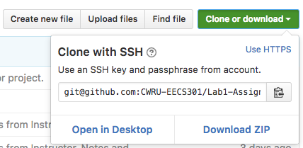

# Git Tutorial

**Git** can be used from either the command-line or from a GUI client application (like **Git GUI** or **GitHub Desktop**).  Both have their advantages so it's beneficial to know how to use both types of interfaces.

* The Git command-line utility provides full access to all of Git's functionality and for simple commits can be faster. Complicated branch/merge, remote changes, or nested repos may also be easier from the command-line but does require higher level Git expertise (most likely beyond the scope of this course).

* The Git GUI clients can make commits with a large number of file changes easier to manage.  Most also have a built-in diff tools and can make partial file (hunk) commits possible.  When working on multiple feature changes in the same code base, these features are invaluable.

The lab assignment documentation will primarily give Git instructions using command-line examples since it is faster and simpler.  Most (but not all) of the tasks can be accomplished using the GUI if you prefer.

## Git from the Command Line

The following **Git** command-line examples assume you are using the **Git Bash** shell.

When a **Git** repository is created or cloned, a single top level directory will be created.  The `git` command can be run from anywhere **inside** of that directory to operate on the repository. 

The `git` command will give a dire error if run from **outside** of a valid Git repository (_"fatal: Not a git repository"_) so make sure to change the directory into the repository after cloning.

:warning: **WARNING**: Cloning a Git repository inside of another repository should be avoided (unless you known what is and specifically want to create a Git Submodule).  Do not do this for this class.

### Git Commands

The most used **Git** commands are:

|  |  |
|---|---|
| `git status` | Display the repository status |
| `git add` | Stage files to be committed |
| `git commit` | Commit the staged files to the repository |
| `git push` | Send local changes to the remote server |
| `git pull` | Retrieve changes from the remote server |
| `git clone` | Clone a repository from the remote server to the local machine |

**NOTE:** From the **Git Bash** command-line, adding `--help` to any of these commands will launch the online help page for the command.

### GitHub's Online Tutorial

GitHub provides an interactive Online Tutorial to learn how to use some basic Git commands: [GitHub's tryGit Tutorial](https://try.github.io/)

Not all the commands presented in the tutorial will be needed for the class but are useful to know.  Branching and merging of repositories will not be required for the class.

**NOTE:** The `git init` command (used in the tutorial to create the repository) will not be needed for the class since all repositories will be automatically generated by GitHub Classroom.

### Lab 1 Assignment Cloning Exercise

You should have already received and created your **Lab 1 Assignment** repository on **GitHub** using the emailed invitation link (if not, then do that now, or if you didn't receive the assignment email then contact the instructor).

**Exercise Overview**

* Retrieve the assignment **SSH URL** from **GitHub**
* Clone the **Lab 1 Assignment** from **GitHub**
* Edit the Report file
* Check the differences
* Stage the changed file
* Commit the changes to the repository
* Synchronize the local changes with **GitHub**

**Exercise Steps:**

1. The **SSH URL** for the lab assignment is needed to clone the repository from **GitHub** to your development machine.  

	1. From a web browser, log into the [**EECS301 GitHub**](https://github.com/CWRU-EECS301-S18) homepage (right-click [here](https://github.com/CWRU-EECS301-S18) and select _Open Link in New Tab_).
	
	1. Your Lab 1 Assignment should be listed.  Click the assignment link to open the repository.

	1. The **SSH URL** can be found by clicking on the green **Clone or download** button located on the right-hand side of the page.

		:warning: Make sure the window says **Clone with SSH** (if not, click **Use SSH**).  

		

	1. Copy the URL (there's a convenient copy button).

1. Next, clone the **Lab 1 Assignment** from **GitHub** to the local machine.

	1. Launch **Git Bash** to use the **Git** command-line tools.

	1. From the **Git Bash** command-line, change the directory to where your lab work is stored (e.g. on the lab machines `/h/Projects/EECS301/`).

		```shell
		$ cd /h/Projects/EECS301
		```
	
		**NOTE:** If the directory doesn't exist, it can be created with this command:
	
		```shell
		$ mkdir -p /h/Projects/EECS301
		```

	1. Clone your **Lab 1 Assignment** repository to the current directory on the local machine using the following command and the copied **SSH URL**:

		```shell
		$ git clone paste-SSH-URL-here
		```	

		For example:
		
		```shell
		$ git clone git@github.com:CWRU-EECS301-S18/lab1-assignment-user.git
		Cloning into 'lab1-assignment-user'...
		remote: Counting objects: 154, done.
		remote: Compressing objects: 100% (111/111), done.
		remote: Total 154 (delta 35), reused 154 (delta 35), pack-reused 0
		Receiving objects: 100% (154/154), 5.18 MiB | 7.06 MiB/s, done.
		Resolving deltas: 100% (35/35), done.
		```

		**NOTE:** In **Git Bash**, the paste key command is **Shift+Ins**. Alternately, right-click in the window and select Paste from the menu.
		
	1. Change the directory into the repository (using your repository directory name of course):

		```shell
		$ cd lab1-assignment-user
		```
		
	1. Check the repository status to verify the working tree is clean.

		```shell
		$ git status
		On branch master
		Your branch is up-to-date with 'origin/master'.
		nothing to commit, working tree clean
		```
			
1. Open the Lab Report **README.md** file for editing:

	```shell
	$ nano Lab1-Report/README.md
	```
	
	Edit the Name and E-mail address line to insert your name and e-mail.
	
	Save your changes with **Ctrl+o**
	
	Exit with **Ctrl+x**
	
1. Check the status again to see that the README.md file was modified.

	```shell
	$ git status
	On branch master
	Your branch is up-to-date with 'origin/master'.
	Changes not staged for commit:
	  (use "git add <file>..." to update what will be committed)
	  (use "git checkout -- <file>..." to discard changes in working directory)

	        modified:   Lab1-Report/README.md
	
	no changes added to commit (use "git add" and/or "git commit -a")
	```
	
1. Changes to a file can be checked against the repository by running a difference report. **Git** provides the `git diff` command for this:

	```shell
	$ git diff
	diff --git a/Lab1-Report/README.md b/Lab1-Report/README.md
	index 5925d2d..4d5166b 100644
	--- a/Lab1-Report/README.md
	+++ b/Lab1-Report/README.md
	@@ -1,6 +1,6 @@
	 # EECS301 Lab #1 Report
	
	-**Names (e-mail_1@case.edu, e-mail_2@case.edu)**
	+**User (user@case.edu)**
	
	 ## Introduction
	```
	
	**NOTE:** Lines prefixed with `-` were removed and lines with `+` were added.

1. Next, the changes need to be checked back into source control.  For **Git**, the first step is to **Stage** the files you want to **Commit**.

	1. Looking at the previous **Git** **Status** output, you can see the **README.md** file was listed in the `Changes not staged for commit:` section as modified.

	1. Use the `git add` command to **Stage** the README.me file for the **Commit**:
	
		```shell
		$ git add Lab1-Report/README.md
		```
	
	1. Check that the file has been **Staged** with the **Status** command (staged files appear under the `Changes to be committed:` section):
	
		```shell
		$ git status
		On branch master
		Your branch is up-to-date with 'origin/master'.
		Changes to be committed:
		  (use "git reset HEAD <file>..." to unstage)
		
		        modified:   Lab1-Report/README.md
		```

1. Once all the files to be checked in have been **Staged**, the changes can be **Committed** to the repository.

	The following command will start the **Commit**:
	
	```shell
	$ git commit
	```
	
	The text editor will launch so a **Commit Message** can be entered.  The **Commit Message** will be displayed in the **Git Log** for the commit to describe what was changed.  Add a message and save the changes.
	
	**NOTE:** The default editor is [**vim**](http://www.vim.org) which can be difficult to use (here's a [cheat sheet](https://vim.rtorr.com)).  Press `i` to insert text and `:wq` to save and quit.  Switching the editor to [**nano**](StartingGitHub-Guide.md#default-editor) is recommended for those unfamiliar with vi commands.
	
	**NOTE:** Short commit messages can also be added on the command-line using the `-m` option.  This can be faster but is limited to a single line of text.
	
	```shell
	$ git commit -m "Minor Text Fixes"
	``` 
	
1. The **Commit** log can be viewed using the command `git log`

	```shell
	$ git log
	commit 2d364a6228833eb72a3390d6af86c5f6993437c0 (HEAD -> master)
	Author: Matt McConnell <mjm28@case.edu>
	Date:   Thu Aug 17 13:31:26 2017 -0400
	
	    Updated Report with User name.
	    
	```
	
	**NOTE:** Each **Commit** is assigned a unique SHA-1 hash: (e.g. `2d364a6228833eb72a3390d6af86c5f6993437c0`) which can be viewed in the log and used to identify specific repository versions.
	
	**NOTE:** To escape the log viewer press **q**.  The arrow keys can be used to scroll the log messages up/down or left/right.  The spacebar will page-down.
	
1. The **Commit** command only checks code into the local repository.  If you want to synchronize your local changes with the remote GitHub repository then you will have to **Push** the changes using the `git push` command.

	```shell
	$ git push
	Counting objects: 4, done.
	Delta compression using up to 2 threads.
	Compressing objects: 100% (3/3), done.
	Writing objects: 100% (4/4), 369 bytes | 0 bytes/s, done.
	Total 4 (delta 2), reused 0 (delta 0)
	remote: Resolving deltas: 100% (2/2), completed with 2 local objects.
	To github.com:CWRU-EECS301-S18/lab1-assignment-user.git
 	  a74a588..2d364a6  master -> master
 	  
	``` 
	
	You can check the GitHub website to see the changes were indeed **pushed** to the GitHub server.
	
	When working in groups, when one person **pushes** changes to GitHub, the other person can retrieve the changes by doing a **pull** using the command `git pull`.
	
	In the event that both group members made changes, a **merge** may be required.  Sometimes this can happen automatically if the changes do not conflict, but if the same file was changed then the conflicts will have be resolved manually.  On the lab machines, the program [**WinMerge**](http://tour.winmerge.org) can be used to help resolve merge conflicts.

That covers the bulk of the **Git** operations needed for the class.

### Lab Assignment Updates

Occasionally, lab assignments may require corrections or additions after the assignments have been distributed.  For this class, any lab assignment updates will be directly merged with your GitHub repository and you will be notified by either Slack or by e-mail.

After an update merge occurs, you will need to synchronize any cloned copies of the lab assignment repository with GitHub.  This is an easy process (usually) using the `git pull` command.

Like all git commands, the `git pull` command must be run from inside a **Git** directory.  The remote changes will be merged into your local repository, usually automatically.  If a file is modified both on the remote server and on your local machine, then a conflict error will occur which has to be fixed manually.

The following example shows a typical synchronization pull:

```shell
$ cd /h/Projects/EECS301/lab1-assignment-user
$ git pull
remote: Counting objects: 56, done.
remote: Compressing objects: 100% (42/42), done.
remote: Total 56 (delta 30), reused 26 (delta 14), pack-reused 0
Unpacking objects: 100% (56/56), done.
From github.com:CWRU-EECS301-S18/lab1-assignment-user
   1020321..8ea7ccd  master     -> origin/master
Updating 1020321..8ea7ccd
Fast-forward
 Lab1-Guide/DevKitHardware-Guide.md     |   6 +
 Lab1-Guide/FrustrationLab-Guide.md     | 432 +++++++++++++-----------
 Lab1-Guide/ModelSimOverview-Guide.md   | 583 +++++++++++++++++----------------
 Lab1-Guide/QuartusProject-Guide.md     |   9 +-
 Lab1-Guide/README.md                   |  85 -----
 Lab1-Guide/StartingGithub-Guide.md     |   3 +
 Lab1-Guide/images/Quartus04.png        | Bin 59715 -> 44587 bytes
 Lab1-Guide/images/Quartus04e.png       | Bin 50425 -> 39951 bytes
 Lab1-Guide/images/QuartusAddFile01.png | Bin 0 -> 97029 bytes
 Lab1-Project/EECS301_Lab1_TopLevel.v   |  16 +-
 README.md                              |  13 +-
 11 files changed, 577 insertions(+), 570 deletions(-)
 delete mode 100644 Lab1-Guide/README.md
 create mode 100644 Lab1-Guide/images/QuartusAddFile01.png
 
```

## Git from the GUI

### Git GUI

To learn more about the **Git GUI**, read through this guide: [An Illustrated Guide to Git on Windows](https://nathanj.github.io/gitguide/tour.html)

### GitHub Desktop

After installing the **GitHub Desktop**, there is a short tutorial pointing out key features.

To learn more about the **GitHub Desktop**, read through this guide: [Getting Started with GitHub Desktop](https://help.github.com/desktop/guides/getting-started/)


## References

* [GitHub Cheat Sheet](https://education.github.com/git-cheat-sheet-education.pdf)
* [Visual Git Cheat Sheet](http://ndpsoftware.com/git-cheatsheet.html)
* [Git Documentation](https://git-scm.com/doc)

---

Jump back to the main assignment here: [Lab 1 Assignment](../README.md)
