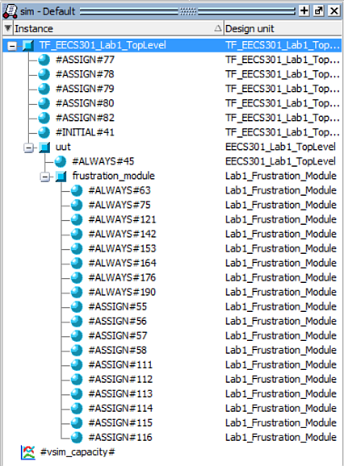

# ModelSim Overview Guide

Creating a simulation test bench is essential for debugging FPGA projects.  Control signals and register values can be extremely difficult to see on hardware, but the simulator allows viewing everything in the system and provides the ability to create verification tests to automate debugging.

There are two types of simulation: **behavioral** simulation and **gate-level** (aka timing) simulation.  The main difference is **gate-level** simulation includes timing information for the fully routed design whereas the behavioral simulation assumes ideal timing.  With timing concerns removed, behavioral simulation is much faster and uses less memory than gate-level simulation.

For most practical design flows, behavioral simulation is used to verify that the design logic is working properly, then the design is tested on the hardware.  If timing issues are seen or if the design has timing problematic features, then the gate-level simulation is run.  For mission critical designs, always verify both simulations.

Modular HDL design makes code verification and debugging with simulation easy and practical.  Modules have a defined port list of all inputs and outputs.  As each module is constructed, an associated test bench can be written to test the functionality of the module by simulating the input signals and validating the output signals.

Validation testing can be done either _manually_, where the designer has to look at the simulation waveform output to check for correct operation, or _automatically_, where the output signals are programmatically checked against expected values to give a pass or fail indicator.  

The manual process is basically a programmer's sanity check and is a useful tool for quickly checking if a module is functioning as expected.  We'll call this manual process a **Functional Check**.  

The automated process uses simulation routines to fully verify that a design meets the expected functionality through programmatically generated pass/fail criteria.  Automated test creation involves more work but reusing the tests in later design phases for regression testing results in a more reliable product.  The automated testing is known as [**Functional Verification**](https://en.wikipedia.org/wiki/Functional_verification).

The [**ModelSim**](https://www.mentor.com/products/fv/modelsim/) simulation tool will be used for both types of functional testing.  Although ModelSim is a third-party tool developed by Mentor Graphics, the Quartus Development Software has integrated support to manage and launch simulation test benches directly from the Quartus IDE.

This guide presents how to setup a simple simulation to test the push button inputs for the Lab 1 design.  The walkthrough includes configuring Quartus to launch the simulation, covers the most used features in the ModelSim IDE, and highlights a few unique simulation code features by adding a new simulation test pattern.

## Assignment Step Overview

* Configure the Simulation Test Bench in Quartus
* Launch the ModelSim Simulation
* Walkthrough of ModelSim Windows
* Add a new Simulation Test Pattern

## Configure Test Bench for Simulation

Quartus will launch the ModelSim simulator but the settings for each simulation test bench must be configured first.  Unfortunately, Quartus has the simulation settings buried so there are a number of cluttered windows to navigate. Don't Panic.

### Assignment Steps:

1. If not open already, start Quartus and load the Lab 1 Assignment project.

1. On the **Tasks** panel, change the design flow from _Compilation_ to _RTL Simulation_.

	The Task list now only shows simulation options.

	

1. From the task list, double-click on **Edit Settings** under **RTL Simulation** to bring up the **Simulation** settings window:

	

	This settings window will be used to configure Quartus to launch the ModelSim simulator.

1. Add a new test bench by first selecting the **Compile test bench** option in the **NativeLink settings** box (in the lower part of the window).

1. Next, click on the **Test Benches...** button to bring up the **Test Benches** dialog:

	

	This dialog will list all the Test Benches you've configured for your project.

1. Add a new Test Bench by clicking on the **New...** button to bring up the **New Test Bench Settings** dialog:

	

	In the **New Test Bench Settings** dialog, set the following settings...

	* Set Test Bench name to **TF\_EECS301\_Lab1\_TopLevel**
	* Set Top level module to **TF\_EECS301\_Lab1\_TopLevel**
		* **Warning:** These names are not the filename so do **not** append a `.v` to the module name. You'll get some really confusing, non-obvious error messages if you do.
	* Set Simulation end time to **100uS**
		* Note: This is the initial run-time, once in ModelSim you can run as much time as you need.
	* Add the **TF\_EECS301\_Lab1\_TopLevel.v** file
		* Note: After selecting the test bench file in the **Select File** dialog, the **Add** button must still be clicked before it is added to the list.

	
	
	Once everything's entered, click the **OK** button to save the settings.

1. Back on the **Test Benches** window, you should see your new test bench listed.

	
	
	Click on the **OK** button to exit.

1. Back on the **Settings** window:

	The new test bench should now be listed in the Test Bench drop-down list.

	:information_source: It's possible to have multiple test benches in a design.  The Test Bench drop-down selects the active test bench. 
	
1. The last step in the **Settings** window is to set the simulation setup script to automatically configure the ModelSim waveform signals. 

	* Enable the checkbox **Use script to set up simulation**

	* Click on the file add button `...` and select the script file **_simulation/modelsim/wave.do_**
	
	:information_source: Creating a setup script for your test bench is a great time saver when running your test bench multiple times.  The simulation can be run without a setup script but you'd have to configure the signals every time you re-launched the simulation.

1. We should be done with Settings now.  Double-check your settings appear the same as the **Settings** window shown here:

	

1. Click **OK** to save the settings.

Luckily, the Test Bench settings will only need to be configured once. The simulation can now be run from the main window.

## Launching The Simulation

[ModelSim](https://www.mentor.com/products/fv/modelsim/) is a separate functional verification application that is launched from Quartus to run the design simulations.  Both Verilog and VHDL languages are supported (including mixed-language projects).

### Lab Machine Setup

The path for ModelSim may be missing on the Lab computers. Verify the path with the following steps:

1. From the menu bar, select **Tools** -> **Options...** to open the **Options** window.

2. In the left-side panel, click on **EDA Tool Options**.

3. Make sure the entry for **ModelSim-Altera** is set to `C:\intelFPGA\17.0\modelsim_ase\win32aloem`.

	The final settings should look like this:
	
	
	
**NOTE:** This path setup should only need to be done once for your user account.

### Assignment Steps:

1. Select the **RTL Simulation** flow from the **Tasks** pane drop-down list.

1. In the **Tasks** pane, right-click on the **RTL Simulation** and select **Start** from the menu to launch the simulation.  Alternatively, you can just double-click **RTL Simulation** since the default action is **Start**.

	

	:warning: **NOTE:** On Windows 10 there is a bug launching ModelSim from the **Tasks** pane.  Instead, launch the simulation from the menubar by selecting **Tools** -> **Run Simulation Tool** -> **RTL Simulation**.
	
	:warning: **NOTE:** On Linux, there are a number of problems that can happen when launching ModelSim.  See the Linux Setup Guide to make sure the 32-bit drivers are setup properly.

The design will first run though the **Analysis & Elaboration** step in Quartus, which pre-compiles code for simulation.  If the pre-compile catches any errors in the code, the **Error** messages will be in the **Messages** window.

After a clean pre-compile, **ModelSim** will launch then re-compile all the code using its own synthesizer.  Error messages will be displayed in the **Transcript** window.  The ModelSim compiler may catch problems that Quartus did not so make sure to check the window for warning messages.

After a clean compile, the **ModelSim** waveform window should be shown...


## Overview of the ModelSim Window

Expect some frustration here because ModelSim throws a ton of stuff at you without much explanation of what to do.  We'll walk through the parts you'll need most for simulation testing.

### Default Window Layout

:warning: **NOTE:** Windows in the layout can be moved around or closed.  If you loose a window, you can reset back to the default layout from the menu **Layout** -> **Reset**.  After the reset, you'll need to resize some of the windows to get back to a working configuration.


1. **Library** Tab

	The **Library** tab has a list of all the files that were pulled into the simulation.  This includes all the files from the Altera simulation libraries so there are a lot of files.  Your project files should show up at the top of the list in a library called **Work**.

	

	:information_source: Right-clicking a file here gives you an option to **Recompile** the file.  This is useful when editing files in Quartus while debugging the simulation.  The changes can be recompiled without having to reload ModelSim.

2. **Sim** Tab

	The **Sim** tab shows you a hierarchical tree list of all the modules in your project.  The names given to the instantiated modules are show in the list (e.g. **uut** and **frustration_module**).

	

	Selecting a module from the list will update the **Objects** window with a list of all the signals from the module (see the next section).

	Double-clicking a module will open the file in which the module is defined.  This lets you view or edit the code from the simulator but be careful making changes if the file is also opened in Quartus.  You could loose your edits if you save the old copy overtop the new.

3. **Objects** Window

	The **Objects** window shows a list of all the registers, wires, and parameters defined in a module.  Multi-signal items are shown as an array that can be expanded to show each individual signal.

	

	Double-clicking an item in the list will open the file to where the signal is defined.

	Most usefully, items in the list can be selected and dragged to the **Wave** window to add them to the simulation.

4. **Transcript** Window

	The **Transcript** window shows the compiler output, simulation actions, and can be used to issue commands to ModelSim.

	

	After loading a simulation or recompiling modules, check the **Transcript** window to make sure no errors or warnings were issued.  

	:information_source: The ModelSim compiler will catch some code errors that Quartus will not so it's useful to check all the warning messages.

5. **Wave** Window

	The **Wave** window is where all the action happens in ModelSim.  

	

	The Wave window is similar to that of an oscilloscope or logic analyzer.  The simulator will capture the running state of all the signals listed in the Wave window and display the signal states on the time graph.  
	
	Cursors can be used to measure the time between different signal events.
	
	The waveform window can zoom in and out using the toolbar buttons or from the keyboard by holding the Ctrl button then click-dragging a section of time.

6. **Dock/Undock** Window Control

	:information_source: All windows in ModelSim have three small buttons in the top-right corner.  The middle button will allow a window to be Undocked from the main ModelSim window into its own window.  If you are working on a multiple monitor station, this can be used to split ModelSim windows between the monitors.

### Tool Bar Buttons

At the top of the ModelSim window is the Toolbar with buttons for numerous ModelSim functions.  (Probably too many by default.)

Some useful things to note:

* Toolbar groups will shift around when the window is resized so you might have to hunt for where the buttons moved.
* Toolbar groups can be dragged around to reorder them more conveniently.
* Right-clicking on the toolbar shows a menu to enable or disable individual toolbar groups.

We'll go over the most used functions you'll need from the Toolbar:

* **Simulate** Toolbar Group

	

	1. **Restart:** Restart the simulation

		After adding new signals to the Waveform window or recompiling the design, the Restart function will clear any current waveform data and set the simulation time to zero.

		You will be presented with an option dialog when restarting.  Typically, you'll want to keep all the items in the list so just hit the **OK** button.

		

	2. **Run Time:** Set the simulation execution time used by the **Run** function (units can be _ns_, _us_, _ms_, or _s_)

	3. **Run:** Run the simulation for the time specified by **Run Time**

	4. **Break:** Immediately stop the running compilation or simulation.

	5. **Stop:** Stop the running simulation at the next time interval.

* **Zoom** Toolbar Group

	

	1. **Zoom In:** Zoom the waveform window in by 2x

	2. **Zoom Out:** Zoom the waveform window out by 2x

	3. **Zoom Full:** Show the full simulation waveform in the window

	4. **Zoom In On Active Cursor:** Zoom the waveform window in by 2x with the  active cursor centered in the window

	5. **Zoom Between Cursors:** Show the full area between two cursors in the window

* **Wave Cursor** Toolbar Group

	

	1. **Previous Transition:** Move the active cursor to the previous transition of the selected signal

	2. **Next Transition:** Move the active cursor to the next transition of the selected signal

### Additional Reference Material

This brief intro to ModelSim only scratches the surface.  For more in-depth information check these references:

* **ModelSim PDF Bookcase**

	

	The **ModelSim PDF Bookcase** is installed with ModelSim.  It's accessible from the menu bar:

	 **Help** -> **PDF Documentation** -> **ModelSim PDF Bookcase - Altera**

## Adding a Simulation Test Pattern

Simulation is the primary way to debug hardware designs so it is an important concept that will be focused on throughout the lab assignments.  For the final part of the lab, a review of the provided simulation test bench code will provide insight to the verification concepts and coding methods needed for reliable FPGA design.  After reviewing the code, you'll add a new Key input Test Pattern to the test sequence with your favorite number between 1 and 10.

### Assignment Steps:

1. Open the **TF\_EECS301\_Lab1\_TopLevel** module in Quartus.

	**NOTE:** You may have to switch the **Project Navigator** drop-down selection to the **Files** mode to see the test bench module.

1. Review the test bench code paying attention to the following points.

	* This is a **Functional Verification** test bench which automatically verifies the output for given test inputs and reports a pass/fail result for each test.  Every push button combination is tested so this simulation provides **Full Coverage** verification (for the LEDR output).

	* The 50 MHz clock, `CLOCK_50`, is generated by toggling the clock signal after a 10 ns delay in an infinite loop.  The delay period is calculated using parameters which are covered in the next lab.  All FPGA designs have clock sources so this will be a common emulation structure. 

	* The `EECS301_Lab1_TopLevel` module is instantiated with port connections for all the input and output signals.  The module being tested is often referred to as the Unit Under Test (UUT).  The simulation test sequence sets the input signal values then verifies that the correct output response occurs.

	* Expected output values must be computed (or loaded from a file) for each test vector applied to the module.  The **Expected Key Value** is computed by summing the values of the pressed keys.  That value is then used to determine which LED outputs should be enabled.  The **Expected LEDR Value** is then used to verify the LEDR signal outputs from the module.

	* The main test routine is normally implemented in an **initial** process using ***blocking*** signal assignments to sequentially execute the test routine.  The difference between _blocking_ (`=`) and _non-blocking_ (`<=`) assignments is important and covered in the next lab.

	* Delay operations can be used to pace the timing of the test sequence.  For instance the command `#1000;` delays 1000ns before executing the next operation (but only works for _blocking_ operations).  Delays are used throughout the test sequence to specify how long to hold a key press and when to check the verification results.  More advanced timing mechanisms will be used in future labs.

	* The `$display()` function works similarly to the `printf()` function in C.  Text strings can be written to the terminal message window to provide testing information.

	* The `KEY` register is a 4-bit wide vector.  The whole register can be written at once (`KEY = 4'hF`) or the bits can be individually indexed (`KEY[0] = 1'b1`).  The Key Button signals are active-low logic so its low (`1'b0`) when pressed and high (`1'b1`) when not pressed.

	**NOTE:** The Verilog syntax will be covered more in the next lab but if this doesn't make any sense at all then looking through this [Verilog Tutorial](http://www.asic-world.com/verilog/veritut.html) would be a good idea.

	* The _for_ loop is used to cycle though all 16 Key input combinations.  The _for_ operation is mostly the same as in C (with a few restrictions).

1. Now to add an additional Key Test Pattern. First, find the following comment block in the code:

	```verilog
	//
	// Add another Key Test Pattern here...
	//
	#2000;
	```
	
	The new test pattern will be placed after the delay command, `#2000;`, which pauses the process execution for 2000 ns.
	
	**NOTE:** The notion of time is a unique feature in the Verilog language.  Delays can be used to construct simple stimulus signals or to model real-world propagation delays.  The unit of the delay (1ns in this case) is set by the **timescale** directive listed at the top of every file.

1. Use the single button press test routine as a template for your code (copy-and-pasting code speeds development).

	```verilog
	KEY[0] = 1'b0; // Press Key
	#100;
	test_pass_fail = exp_ledr_value == LEDR ? 1'b1 : 1'b0;  // This uses the ternary if-then-else operation
	if (test_pass_fail)
		$display(" KEY[0] Press Passed. Key Value = %d", exp_key_value);
	else
		$display(" KEY[0] Press FAILED!!!  Expected [%010b] != Actual [%010b]", exp_ledr_value, LEDR);
	#900;
	KEY[0] = 1'b1; // Release Key
	```

1. Modify the Key press and release lines to set all four bits of the `KEY` register (as is done in the full coverage loop routine).  The `KEY` register is a 4-bit vector so a 4-bit value needs to be assigned.
	
	In Verilog, constants are defined using the syntax `<size>'<radix><value>` so to specify the value **ten** as a 4-bit vector any of the following radix options can be used.
	
	| Radix       | Constant (Ten) |
	|-------------|-----------|
	| binary      | `4'b1010` |
	| octal       | `4'o12`   |
	| decimal     | `4'd10`   |
	| hexadecimal | `4'hA`    |

	**NOTE:** Remember the `KEY` input is active-low so 0 is pressed and 1 is released.

1. Save the changes and re-run the simulation to check your new test pattern.

1. Save an image of the waveform window for the Lab Report using the **Export** function.  

	From the ModelSim menu, select **File** -> **Export** -> **Image**.  Change the file type to `*.png` and save the file to the **Lab1-Report** directory of the repository.  
	
	Make sure to add the image to the Lab Report.

---

Return to the [Lab 1 Assignment](../README.md) page...
