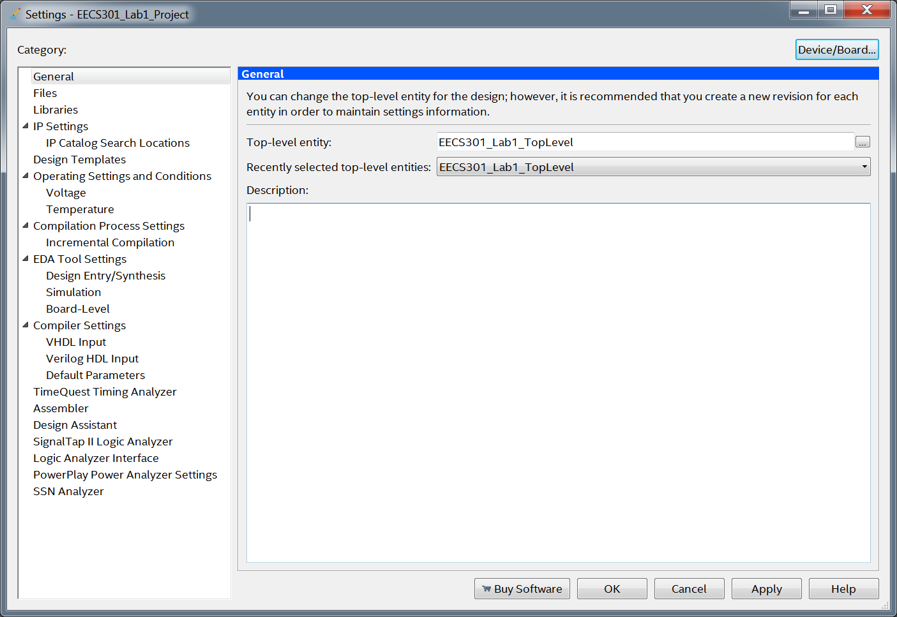

# Quartus Project Guide

## Lab Overview

This lab introduces the development tools used throughout the course.  The development tools include the [Intel® Quartus® Prime Design Software](https://www.altera.com/products/design-software/fpga-design/quartus-prime/overview.html), ModelSim, Git, and various other support applications.

The [TerasIC DE1-SoC Development Board](https://github.com/CWRU-EECS301-S18/syllabus/tree/master/Reference/DE1-SoC/README.md) will be used to run the FPGA lab designs.  The board includes an Altera Cyclone V FPGA and many peripheral devices which will be used throughout the course.  Proper handling protocols to prevent ESD damage will be discussed before the boards are handed-out.

This course utilizes the **Git** version control system to manage all lab assignment projects and documentation.  Assignments are distributed and collected via the **GitHub** hosting service.  See the [**Starting Guide to GitHub**](StartingGithub-Guide.md) for details.

The lab computers in the **Glennan Undergraduate Design Lab** (Glennan 312) are setup and available for all labwork or, **optionally**, you can setup your own development machine using the following guide: [**Development Machine Setup Guide**](DevelopmentMachineSetup-Guide.md).

### Overview of assignment steps: 

* Clone the Lab Assignment Repository from GitHub
* Create the Quartus Project using the Quarts Project Wizard
* Import the FPGA Pin Assignments
* Compile the FPGA Project
* Load the Project on the Development Board

---

## Clone the Lab Assignment Repository

Lab assignments are distributed using **GitHub Classroom** invitations which will be emailed out for each assignment.  This service will allow each student (or group) in the class to have their own individual repository for each assignment. Opening the invitation link and accepting the lab assignment automatically generates the **GitHub** lab assignment repository.  

**NOTE:** There are a number of options for working with **Git** repositories, some of which were detailed in the startup guides.  The lab assignment instructions demonstrate using the **Git Bash** command-line utilities but you are free to use whichever **Git** client you wish.

To begin working on the lab, you'll first need to clone the lab assignment repository to your development machine.  The process was described in the [Git Tutorial](Git-Tutorial.md) so you may have already cloned the repository.

### Assignment Steps:

1. If you **have not** read through the **Git Tutorial** and done the [**Lab 1 Assignment Cloning Exercise**](Git-Tutorial.md#lab-1-assignment-cloning-exercise) do so now.  The exercise clones the lab repository and checks to make sure the tools have been configured properly.

1. Open a **Git Bash** terminal (if not already open) and change the directory to your **Lab 1 Assignment** repository (your path may differ from the example):

	```shell
	$ cd /h/Projects/EECS301/lab1-assignment-user
	```

1. Check the status of the Git repository to make sure the working tree is clean and on the master branch.

	```shell
	$ git status
	On branch master
	Your branch is up-to-date with 'origin/master'.
	nothing to commit, working tree clean
	```

1. The `ls` command can be used to list the files in the directory. 

	```shell
	$ ls -la
	total 28
	drwxr-xr-x 1 user 197121    0 Aug  2 11:32 ./
	drwxr-xr-x 1 user 197121    0 Aug 17 12:49 ../
	drwxr-xr-x 1 user 197121    0 Aug 15 09:09 .git/
	drwxr-xr-x 1 user 197121    0 Aug 15 09:02 Lab1-Guide/
	drwxr-xr-x 1 user 197121    0 Aug 15 12:05 Lab1-Project/
	drwxr-xr-x 1 user 197121    0 Aug  2 10:27 Lab1-Report/
	-rw-r--r-- 1 user 197121 6078 Aug  2 10:27 README.md
	```

	This directory structure will be used throughout the labs:
	
	| Directory | Purpose |
	|-----------|---------|
	| `.git`  | The Git repository **(DO NOT EDIT ANY FILES IN THIS DIRECTORY)** |
	| `Lab1-Guide` | Lab guide documentation |
	| `Lab1-Project` | FPGA project directory |
	| `Lab1-Report` | Lab report directory  |
	
Once the Lab Assignment repository is cloned to the local machine, you can move on to creating the Quartus project.

## Create the Quartus Project

:information_source: Each lab will include _framework_ files in the Lab Project directory.  The framework provides coding examples, simplifies complicated design components, and eliminates tedious parts of the FPGA project. Reviewing the provided framework would be instructional to see what's needed to create a full design from scratch but, due to lab time constraints, we'll focus on the core parts of FPGA design.  You're encouraged to use the framework code as a reference for your own code.

In the following section, we'll create a new Quartus project, using the **New Project Wizard**, and import the framework code that was included in the Lab Assignment repository.

### Assignment Steps:

1. Start Quartus Prime 17.0 using the desktop icon:

	

	This is the main Quartus window:
	
	

	**NOTE:** In the Quartus IDE, all windows and toolbars can be moved around, hidden or undocked so your screen may look different from the examples if things have been shuffled around.

1. From the menubar, select **File** -> **New Project Wizard...** to create a new project.

	Enter the following parameters in the **New Project Wizard** dialog:
	
	* Set the project working directory to the `Lab1-Project` directory of the Lab Assignment repository.
	* Name the project: `EECS301_Lab1_Project`
	* Name the top level design entity: `EECS301_Lab1_TopLevel`
	* **Verify** the settings match the following image (your project directory path may differ).

	:warning: **WARNING:** Make sure the project name and top level design entity listed are entered exactly as shown, including capitalization.
	
	

	:warning: **WARNING:** When naming projects and files do not use spaces in the file or path names.  Spaces are not handled properly by some of the tools.  If your username includes a space then projects placed on the Desktop or in the Documents directory will also fail.

	Click the  button.

1. Select **Empty Project** for the **Project Type**:

	

	Click the  button.

1. Add framework files to the Project.

	The following files were distributed with the lab assignment repository in the `Lab1-Project` directory:

	```
	EECS301_Lab1_TopLevel.v
	TF_EECS301_Lab1_TopLevel.v
	EECS301_Lab1_Project.sdc
	```

	**WARNING:** Do **not** add the `Lab1_Frustration_Module.v` file to the project.  It will be used later but will cause problems if added now.

	Add these files to the project using the **Add Files** dialog:
	
	
	
	**NOTE:** The small button `...` to the right of the File Name text box will open a Select File dialog where you can select multiple files to add.
	
	**NOTE:** The **File Type** filter needs to be adjusted in order to show the **.sdc** file in the file dialog.
	
	**WARNING:** Quartus may generate errors if non-design files are added to the project so make sure to only add what is specified in the above list.
	
	After adding the files, update the **Type** of the simulation test bench file `TF_EECS301_Lab1_TopLevel.v` by selecting it in the file list and clicking the **Properties** button to open the **File Properties** dialog.
	
	

	Select **Verilog Test Bench File** from the **Type** drop-down list then click the **OK** button to save the change.
		
	The completed file list will look like this:
	 
	

	After all the files have been added and types updated, click the  button.

1. Select the FPGA device for the project.

	:information_source: The DE1-SoC Development Board has an Altera Cyclone V SE FPGA.

	Make the following parameter selections in the **Family, Device & Board Settings** dialog:
	
	* Family: **Cyclone V (E/GX/GT/SX/SE/ST)**
	* Device: **Cyclone V SE Mainstream**
	* Package: **FBGA**
	* Pin count: **896**
	* Core speed grade: **6**

	After making the selections, there should be two options in the **Available Device** list.  Select **5CSEMA5F31C6** from the list.
	
	The final Settings dialog will look like this:
	
	

	After selecting the correct FPGA, click the  button.

1. EDA Tool Settings. 

	Set the **Simulation Tool** to **ModelSim-Altera** and change the **Simulation Format** to **Verilog HDL**.

	

	Click the  button.

1. The Summary page should look like this...

	

1. Click **Finish** to generate the project.

The project will be generated and take you back to the main Quartus window with the project loaded.

## Import the FPGA Pin Assignments

Next, the pin assignments for the design must be set.  This step is **very** important for the design to function properly.  The pin assignments will map the internal FPGA logic signals to the hardware pins of the device.  If the wrong pins are selected, the hardware could be damaged so it's **extremely** important to verify the correct pin mapping for the design has been done before loading an image on to the development board.

:information_source: It is common to target the same hardware design with multiple FPGA projects so storing the pin assignments in an external file that can be shared between projects is quite useful.  Generating the pinout file can be tedious on large designs with hundreds of pins.

### Assignment Steps:

1. Load the pin assignments: 

	From the menubar, select **Assignments** -> **Import Assignments...**

	**NOTE:** The pin assignments for this project are stored in the file `Lab1_Project_Assignments.qsf`.  
	
	Click the `...` button and select the `Lab1_Project_Assignments.qsf` file from the file browser.

	

	Click the **OK** button to apply the pin assignments to the project.

2. Next, double check that the pins were assigned correctly with the **Pin Planner** tool.  

	From the menu bar, select **Assignments** -> **Pin Planner**

	

	This window shows all the pins on the device (896 pins for this part).  The lower table has the pin assignments we imported listed under the **Location** column.  If this column is blank then the pins have not been assigned properly.

	:warning: **NOTE:** At this point, the **Direction** column may say _Unknown_, this is because we haven't Compiled the project yet.  Check back after compiling the project to see the directions listed.

	All other pin attributes can be assigned with the **Pin Planner**, such as I/O Standard, Current Strength, and Slew Rate among others.  If we didn't have a pin assignment file to import, we'd have to manually enter all the pin assignments here.  
	
	For more information about using the **Pin Planner**, see: [Assigning Device I/O Pins with Pin Planner](http://quartushelp.altera.com/15.0/mergedProjects/assign/ase/ase_pro_assigning_pins.htm)

1. If the pin assignments were imported correctly, don't modify anything.  Just close the Window.

	**NOTE:** There is not a **Save** option in **Pin Planner**.  All changes are saved automatically to the project file when you close the window.

Close the **Pin Planner** window to move to the next step.

## Compile the FPGA Project

After the project generation is complete and the FPGA pins are assigned, the main Quartus window should look like this:


The compilation process for FPGA designs is often referred to as **synthesis** due to the fact that the high level code is being translated into logic functions.  Synthesizing FPGA code is a more complicated process than compiling code for a microprocessor system.  Compiling code for a microprocessor system results in native machine language instructions, whereas FPGA code is synthesized into a Register Transfer Logic (RTL) netlist then mapped on to the FPGA fabric of look-up-tables (LUTs), registers and interconnect signals.  The synthesizer has to take the signal path delays between fabric elements into consideration when mapping the RTL logic.

The next step for the assignment is to compile (**synthesize** really but Quartus calls it compiling) the design.  The project framework code will compile without errors so you can see how the process is supposed to go.  Later on we'll add in some bugs so you can see what happens normally.

### Assignment Steps:

1. In the **Tasks** window pane, on the left-hand side, the drop-down menu should be set to **Compilation** (this sets the **design flow** to compile the design).

1. If not enabled, enable the **Messages** window to see the compilation messages by selecting the menu **View** -> **Utility Windows** -> **Messages**.  Alternatively, just click **Alt+3** to toggle the window on or off.

1. Start the compilation by right-clicking on **Compile Design** (in the **Tasks** window) and select **Start** (alternatively, just double-click on **Compile Design** since **Start** is the default action).  

	The compilation process should start.  For this lab, the build time should be between 1 to 2 minutes.

	While **Compile Design** is running the display will look like this...

	


1. When the build is finished you can check the results in the **Messages** window.  If all the files have been added properly, there should be no build errors but there will be a number of build warnings.  This is typical of Quartus and differentiating between bad warnings and ok warnings will be covered later.

	:information_source: The log messages can be filtered based on error level (warning, critical warning, and error) using the three buttons in the upper-left corner of the **Messages** window.  A blue dot above the button means there are messages with that error level.  Filtering the message log makes it much easier to find problem messages among lots of info messages.
	
	
	
	:warning: Generally, you should carefully review the results after every build to make sure there are not any warning messages that are really errors.  Unfortunately, Quartus spews warning messages for things that are actually _OK_ so it takes some experience to know what's a real problem and what is not.  At this point, if there are no red **Error** level messages, you are good.  The warning messages will be covered in more detail later.
	
### Common Problems

* If you are running Quartus on your own machine and are not connected to the Case license server then you may see the following warning message which can be ignored.
	
	```
	Warning (292013): Feature LogicLock is only available with a valid subscription license. You can purchase a software subscription to gain full access to this feature.
	```
	
* If you have an error message similar to the following, then you have most likely used the wrong name for your **Top Level** module in Step 2 of the [Quartus Project Creation](#create-the-quartus-project).
	
	

	To fix this, from the menubar, click on **Assignments** -> **Settings...** to open the project **Settings** dialog.  In the left-hand **Category** list select **General**.  Make sure the **Top-level entity** is set to `EECS301_Lab1_TopLevel` as shown below.
	
	

* For any other errors, check with a TA or post a question on the Slack message board.		

## Load the Project on the Development Board

Next, we'll load the compiled FPGA image on to the DE1-SoC development board.


### Assignment Steps:

1. Jump to the [Development Kit Hardware Guide](DevKitHardware-Guide.md) for board setup and image loading instructions.  Return here when done.

2. A very simple demo was provided with the framework code.  Pressing any of the four buttons will light up an associated LED.  Tryout various button press combinations to see what the pattern is.

As with most hardware projects, getting to the LED blinking stage was a lot of work. Now that the development environment is up and running we can actually start focusing on how to make the logic do interesting things.

---

Return to the [Lab 1 Assignment](../README.md) page...
