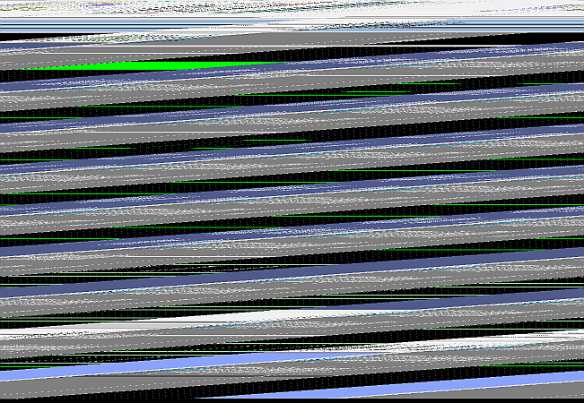

# Screen Capture Guide

Each different operating system has its own unique way to capture screen shots.  Here's a quick summary for each system...

## macOS / OS X

### Summary

Snapshot Modes:

1. Press Shift-Command (⌘)-3 to capture full screen.
2. Press Shift-Command (⌘)-4 to capture selected area.
3. Press Shift-Command (⌘)-4, then press Spacebar to switch to a camera mode to capture full windows.

All snap shots are saved to the desktop.

### Full Guide

* [How to take a screenshot on your Mac](https://support.apple.com/en-us/HT201361)

### Note for Parallels Users

If you are using Parallels to run a Windows VM and are using the Windows Snipping tool, you will want to add a custom key entry for **Ctrl+PrintSc**.

* From the Parallels menubar, select **Devices** -> **Keyboard** -> **Customize...**.  
	Then add the **Ctrl** + **PrintSc** shortcut.

This will make it easier to do _complex_ screen captures (such as right-clicked context menus) with an Apple keyboard which does not include a Print Screen button.

Capture workflow:

1. Start the Snipping Tool and arm it by clicking the New button and then the Cancel button.
1. Set the screen up for the capture (point the mouse, popup a context menu, whatever...)
1. Press **Ctrl + Option** to jump out of the VM.
1. Now send the key command from the Parallels menubar by selecting **Devices** -> **Keyboard** -> **Ctrl+PrintSc**
1. The Snipping tool should activate and let you capture the screen as-is.

## Linux

### Full Guide

* [Screenshots on Ubuntu](https://help.ubuntu.com/stable/ubuntu-help/screen-shot-record.html)

## Windows

### Full Guide

* [Use Snipping Tool to capture screenshots](https://support.microsoft.com/en-us/help/13776/windows-use-snipping-tool-to-capture-screenshots)

## ModelSim Waveform Captures

ModelSim has built-in support to export the Waveform window to an image file.

1. Click in the waveform window to make sure it is the active window.
1. From the menu, select **File** -> **Export** -> **Image...**
1. Set the image type to **PNG**.
1. Save the file.

### Known Problems

A known rendering bug can cause a corrupted image (similar to the image below).

Possible solutions:

* For the lab computers, to work around the problem, make sure the ModelSim window is maximized before capturing the image.

* For a Parallels VM on a Retina display, maximizing the window may clear up the corruption issue but the captured image may be offset or scaled incorrectly.  To workaround the problem, either use an external monitor or use the Windows Snipping Tool to capture the window region.
