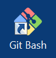
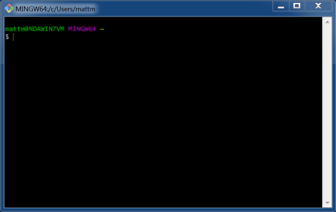

# Starting Guide to [GitHub](https://github.com)

## Introduction

**[Git](https://git-scm.com)** is a distributed version control system which was initially developed to manage the Linux kernel development.  GitHub is a web-based Git repository hosting service which enhances Git with additional project management and collaboration tools.  

GitHub hosted projects can be easily browsed and managed over the web but can also be accessed from Git client applications, such as Git GUI or GitHub Desktop, via either SSH or HTTPS.

This guide will focus on setting up your GitHub account, installing a Git client application on your development machine and cloning the Documentation repo from the class GitHub repository.

## Version Control Basics

We'll be using GitHub for all class projects.  GitHub is a hosting service for Git repositories which provides both direct Git access (via SSH or HTTPS) and a very useful web front-end. There are many online resources for both Git and GitHub, a few of which we'll list here.

Class lab assignment documentation can be best viewed from the web front-end but for the actual lab-work one of the Git applications will be needed.

If you've never used a version control system (VCS) before, familiarize yourself with the basic concepts with this guide...
[About Version Control](https://git-scm.com/book/en/v2/Getting-Started-About-Version-Control)

If you've used a VCS before but not Git, skip to here in the guide to get an overview of Git...
[Git Basics](https://git-scm.com/book/en/v2/Getting-Started-Git-Basics)

---

:information_source: As a student, you should consider using GitHub (or a similar service) not only for this class but for all of your classes.  At minimum, it provides a remote backup of all your work in case of a catastrophic event but there are many other benefits:

* Storing class work in a repository organizes everything into a centralized location
* Retain the history of all your files in case you lose something you needed
* Save scanned handouts, tests, notes, etc to have a paperless archive
* Access your work from any computer via a web browser
* Gain a valuable skill, used in many fields, to list on your résumé
* Easier collaboration management for group projects

GitHub's [Student Developer Pack](https://education.github.com/pack) offers unlimited private repositories and many other tools free for students.

---

## GitHub Account Setup

A lab assignment invitation email was sent to the class after the first lecture with instructions for setting up your **GitHub** account. **If you have not setup your account yet**, please do that now: [**GitHub Account Setup Guide**](https://github.com/CWRU-EECS301-S18/syllabus/blob/master/GitHubAccountSetup-Guide.md)

After your personal account is setup:

1. E-mail your **GitHub** username to the instructor so you can be added to the class **GitHub Student Team**.

1. Jump to the [**Git Client Setup**](#git-client-setup) section of this guide to setup and configure the **Git** client on your development machine.  (Remember to come back for Step 3 afterwards).

	:warning: **NOTE:** The lab machines in the Glennan Design Lab already have the Git client software installed but there are still configuration steps needed for your login profile.

1. Finally, follow the steps in the [**Cloning from GitHub**](#cloning-from-github) section to clone the [EECS301 Syllabus](https://github.com/CWRU-EECS301-S18/syllabus) repository to your local development machine to test your setup.

## Git Client Setup

:warning: **NOTE:** If you are using the lab computers in the Glennan Design Lab, you can skip this section and jump directly to the [**Git Client Configuration (for Design Lab Computers)**](#git-client-configuration-for-design-lab-computers) section to configure the **Git Bash** client already install on the lab machines.

If you are setting up your own machine, you'll need to install a Git Client. The client options and setup varies depending on the machine's operating system. Pick the guide that applies for your machine's OS:

* [Git Client Setup for Windows](GitClientSetup-Windows.md)
* [Git Client Setup for macOS](GitClientSetup-macOS.md)
* [Git Client Setup for Linux](GitClientSetup-Linux.md)

If none of these options work for you, a list of additional git clients can be found here: [GUI Clients](https://git-scm.com/downloads/guis/).


## Git Client Configuration (for Design Lab Computers)

The lab computers in the Glennan Design Lab already have [**Git for Windows**](https://git-for-windows.github.io) installed but there are still a number of configuration steps to personalize your **Git** client.

Run the **Configuration Steps** in the following sub-sections to properly configure the **Git** client.  

:information_source: **NOTE:** Most of the command examples can be cut and pasted into **Git Bash** (omitting the `$` of course) to save time and avoid typing errors.  The paste key command for **Git Bash** is `Shift+Ins` or, using the mouse, just right-click in the window and select Paste from the menu.

:information_source: **NOTE:** The configuration settings presented below are set using the command-line git app but could also be set by editing the `~/.gitconfig` file directly (at your own risk). Using the command-line app is much easier and less error prone so stick to that for now.


### Launch Git Bash

The following configuration steps will use the **Git Bash** command-line.

Launch **Git Bash** using the desktop icon.



The following window should appear (with your own username of course):



The **Git Bash** terminal provides a subset of standard Unix utilities you'd find on the Linux or macOS terminal.  For more information: [Basic Git Command Line Reference](https://www.codeproject.com/Articles/457305/Basic-Git-Command-Line-Reference-for-Windows-Users)


### Name and E-mail Address

**Git** includes a developer name and e-mail address for every commit made to the repository.  The following configuration will set these parameters.

**Configuration Steps:**

1. From the **Git Bash** command-line (or from **Terminal** on Linux/macOS), set your name (replacing **YOUR NAME**) and your email address (replacing **YOUR EMAIL ADDRESS**) using these commands:

	```shell
	$ git config --global user.name "YOUR NAME"
	$ git config --global user.email "YOUR-EMAIL-ADDRESS@case.edu"
	```

2. The parameter values can be checked by running the query commands:

	```shell
	$ git config --global user.name
	YOUR NAME
	$ git config --global user.email
	YOUR-EMAIL-ADDRESS@case.edu
	```

### Default Editor

By default, **Git** will use [**vim**](http://www.vim.org) when editing commit messages.  If you are not familiar with vi command syntax, you will want to change to a different editor, like [**nano**](https://www.nano-editor.org).

**Configuration Steps:**

1. If you **do** want to use the **vim** editor then skip the remaining steps, otherwise continue to the next step to change the editor to **nano**.

2. From the **Git Bash** command-line, change the editor to **nano** using the following command:

	```shell
	$ git config --global core.editor "nano"
	```

	:warning: For this command to work **nano** must be installed on the system.  Linux and macOS systems most-likely already have it installed.  Most Windows systems probably do **not** have it installed, but the lab machines in the Glennan Design Lab have already been setup to be able to use **nano** in the **Git Bash** shell so the configuration command will work.  To setup your own system, see the nano editor section in the [Git Client Setup for Windows](GitClientSetup-Windows.md) guide.

### Windows Editor Alternatives (optional)

On Windows, if you do not want to use **nano**, a good alternative would be [Notepad++](https://notepad-plus-plus.org).  The following configuration command will configure **Git** to use Notepad++:

```shell
$ git config --global core.editor "'C:\Program Files (x86)\Notepad++\notepad++.exe' -multiInst -notabbar -nosession -noPlugin"
```

**NOTE:** One downside, Notepad++ launches its own window for the commit message so you have to edit then save then go back to the original Bash window.  The other editors, nano and vim, both launch in the same Bash window so editing can be seamless and faster.

### Create an SSH Key for GitHub

The [SSH (Secure Shell)](https://en.wikipedia.org/wiki/Secure_Shell) protocol is widely used for connecting to and sending information between remote computers using a secure encrypted tunnel.  SSH will be used when pulling and pushing repository files from the GitHub servers. 

**NOTE:** The following directions are specific for the Glennan Design Lab machines.  If you are setting up your own machine then this guide may be more helpful: [Connecting to GitHub with SSH](https://help.github.com/articles/connecting-to-github-with-ssh/)

**WARNING:** When logging on to the Glennan lab machines, a secure server **H-drive** is automatically mounted for your user account.  This drive should be used to store Lab Projects (`H:\Projects\EECS301\`) and SSH Keys (`H:\.ssh\`).  Files stored on the local **C-drive** (outside of your user profile) will not move from machine to machine and may be deleted on log-out.

**Configuration Steps:**

1. If you are using the Glennan Design Lab computers, the SSH keys will be stored on the H drive.  The directory for the SSH keys may need to be created if it doesn't exist.  From the **Git Bash** command-line, create the directory using the following command:

	```shell
	$ mkdir /h/.ssh
	```

1. From the **Git Bash** command-line, start the SSH key creation with the following command (using your CWRU email):

	```shell
	$ ssh-keygen -t rsa -b 4096 -C "your_email@case.edu"
	```
	
1. First, you will be prompted for where to save the SSH key.  

	```shell
	Enter file in which to save the key (/c/Users/mattm/.ssh/id_rsa):
	```
	
	On the lab machines, the keys should be placed on the H drive (`/h/.ssh/id_rsa`) instead of in the default location.  If the `/h/.ssh` directory doesn't exist, go back to step 1.

	**NOTE:** You may use a name other than `id_rsa` (such as `github_cwru_rsa`) but remember to use your unique name in all the remaining configuration steps.
	
	Enter your SSH key location and press enter:
	
	```shell
	Enter file in which to save the key (/c/Users/mattm/.ssh/id_rsa): /h/.ssh/id_rsa
	```

	:information_source: FYI: By default, SSH keys are stored in `~/.ssh` but the lab machines are using Windows roaming domain profiles so the default location may have security issues.  Instead, the H drive provides somewhat better security to store the SSH keys.

1. Next, a passphrase can be entered for an added layer of security.

	```shell
	Enter passphrase (empty for no passphrase): 
	Enter same passphrase again:
	```
	
	You can either leave this blank (just hit enter) or enter a passphrase string.  Dealing with a passphrase adds an extra layer of complexity when using the SSH key so, if the keys are on a secure filesystem then leaving the passphrase blank may be acceptable.
	
	**NOTE:** If you do enter a passphrase, make sure to read the [SSH Key Passphrases](#ssh-key-passphrases) section below to setup **SSH Agent** to manage the key authentication.

1. The key will now be generated and saved.

	The results will look similar (but not exactly) like this:
	
	```shell
	Your public key has been saved in /h/.ssh/id_rsa.pub.
	The key fingerprint is:
	SHA256:VzhE6RUuk8M9QRaUZ+PgytVh2/I1IAQct6H0lEgJfmk your_email@case.edu
	The key's randomart image is:
	+---[RSA 4096]----+
	|       .+*OOO+   |
	|      . .*BO*o*  |
	|       . EO=*B.= |
	|        o .*o.=.o|
	|        S..o   oo|
	|         .o     .|
	|                 |
	|                 |
	|                 |
	+----[SHA256]-----+
	```
	
	:information_source: The SSH key consists of two files: the private key (`id_rsa`) and the public key (`id_rsa.pub`).  The private key should always be kept secure.  The public key will be given to the host that will be connected to (e.g. GitHub).

	
### Adding the SSH Key to GitHub

The public SSH key has to be given to GitHub so they can authenticate your SSH login.

**Configuration Steps:**

1. From the **Git Bash** command-line, copy the contents of the public SSH key file to the clipboard using the following command:

	```shell
	$ cat /h/.ssh/id_rsa.pub | clip
	```
	
1. From a web browser, log into your [GitHub](https://github.com) account (right-click [here](https://github.com) and select _Open Link in New Tab_).

1. In the upper-right corner of the GitHub page, click on the **Profile Picture Icon** (to the right-side of the plus sign) and select **Settings** from the menu.

1. On the **Settings** page, click on **SSH and GPG keys** from the left-side menu.

1. Click on the **New SSH Key** button.

1. Add a **Title** for your key (such as "CWRU Roaming Key")

1. Paste the public key, which was copied in the first step, into the **Key** field.

1. Click the **Add SSH key** button to save the new key.

:information_source: The public SSH key is now stored in your GitHub profile and can be used for any repositories you have access to on GitHub.  In the next section, a Git client-side application will be setup to verify the SSH key works properly.

### Configuring Command-Line Git SSH Access

When running **Git** from a command-line app (either **Git Bash** on Windows or **Terminal** on Linux/macOS) with an SSH remote, SSH will need to know which private SSH key to use for the host.  This host information can be set in the **SSH config** file.

By default, the **SSH config** file is stored at `~/.ssh/config` for each user.  This should be the case on Linux, macOS, and when using **Git Bash** on Windows.  For the Glennan Design Lab computers, `~/.ssh/` translates to `C:\Users\username.ADS\.ssh` which is part of your roaming profile. 

**NOTE:** On the Glennan lab machines, the **SSH config** file and the **SSH Keys** are stored in two different locations due to security concerns.  Typically, these would be stored in the same location for most installs.

**Configuration Steps:**

1. First, check to make sure the `~/.ssh` directory exists, if not, then create it.  

	From the **Git Bash** command-line, the `mkdir` command with the `-p` option can be used to do both steps.

	```shell
	$ mkdir -p ~/.ssh
	```
	
1. Create (or edit if it already exists) the **SSH config** file to add a GitHub host entry using your preferred text editor (i.e. **nano**).
	
	Open the `config` file in the **nano** editor:

	```shell
	$ nano ~/.ssh/config
	```

1. Copy this **Host** definition entry to the file (fixing the **SSH Key** name if you changed it):

	```
	Host github.com
	    HostName github.com
	    PreferredAuthentications publickey
	    IdentityFile /h/.ssh/id_rsa
	    
	```

	:warning: **WARNING:** Path names are case-sensitive.

	Save the config file using the **nano** command **Ctrl+o** then **Enter** to save the file.
	
	Exit **nano** using the command **Ctrl+x**

1. Test your new configuration using the SSH test command:

	```shell
	$ ssh -T git@github.com
	```
	
	You will most likely see a message similar to that shown below due to not having connected to the SSH server before.  Type `yes` to continue.
	
	```shell
	The authenticity of host 'github.com (192.30.253.112)' can't be established.
	RSA key fingerprint is SHA256:nDrgF5kDj4JEf3diOP3dmffUiwTqDc5hVviKw6f5s78.
	Are you sure you want to continue connecting (yes/no)?
	```
	
	Once a connection is established, the SSH server will be remembered and you won't see this message again.
	
	A successful connection will result in the message:
	
	```shell
	Hi user! You've successfully authenticated, but GitHub does not provide shell access.
	```

	The SSH connection is working properly and you can jump to the [**Cloning from GitHub**](#cloning-from-github) section.
	
	:warning: If you are prompted for a passphrase, see the next section about [SSH Key Passphrases](#ssh-key-passphrases).


### SSH Key Passphrases

**NOTE:** You can skip this section if you left the passphrase blank.

If you've added a passphrase to your SSH Key then you may need to add your key to **SSH Agent** using the command:

```shell
$ ssh-add /h/.ssh/id_rsa
```

You'll be prompted for your passphrase.  

:warning: If you get the message "_Could not open a connection to your authentication agent._", then you need to start the SSH Agent with the following command:
	
```shell
$ eval "$(ssh-agent -s)"
Agent pid 2964
```
	
**NOTE:** The Agent pid will be unique for your machine.  

Once the SSH Agent is started, you can try adding the SSH key again.

:information_source: SSH Agent will remember your passphrase until it is shutdown (i.e. on a machine reboot).  You'll then have to rerun the ssh-add command to authorize your key again.

:information_source: For a list of the currently active identities run this command (using a lower-case L not 1):
	
```shell
$ ssh-add -l
```

:warning: If you see the following message from Git, it probably means your passphrase has not been authorized with SSH Agent.

```
Permission denied (publickey).
fatal: Could not read from remote repository.

Please make sure you have the correct access rights
and the repository exists.
```

### Multiple GitHub Profiles (optional)

:warning: **NOTE:** This shouldn't be needed for this class but if for some reason you have multiple accounts on GitHub...

The SSH **config** file can also be used to add multiple user profiles for GitHub by adding alternate **Host** entries.  

For this example, the SSH Host `github.com` is changed to `alt.github.com` (you can name it whatever you like).  The HostName remains `github.com` since that's the actual server being connected to.  The IdentityFile is changed to a different SSH Key.

```
Host alt.github.com
    HostName github.com
    PreferredAuthentications publickey
    IdentityFile ~/.ssh/alt_github_rsa
```

Git will automatically use the information for `alt.github.com` listed in the config entry when making the SSH connection to GitHub.

When cloning a repository using the alternate account make sure to modify the host name to `alt.github.com`:

```shell
$ git clone git@alt.github.com:CWRU-EECS301-S18/syllabus.git
```

Your Git remote using your alternate profile will then be:

```
$ git remote -v
origin	git@alt.github.com:CWRU-EECS301-S18/syllabus.git (fetch)
origin	git@alt.github.com:CWRU-EECS301-S18/syllabus.git (push)
```

---

## Cloning from GitHub

Now, to verify the Git client and GitHub account were setup correctly, we'll clone the [**syllabus**](https://github.com/CWRU-EECS301-S18/syllabus) repository from the **EECS301 GitHub** to the local machine.

:information_source: For Git, **cloning** means to make a full copy of a remote repository on the local system.  The cloned copy will contain the full version control history and can be used independently of the remote server.  The Git **push** and **pull** commands are used to synchronize the remote and local repositories.

A GitHub repository can be cloned either using a graphical client application (like **Git GUI** or GitHub Desktop) or from the `git` command-line application from a terminal shell (like **Git Bash**).  The following demonstration will use the command-line application since it has more features and is typically faster for most operations.

**NOTE:** In order to keep things organized, it's recommended to create a project directory (such as `C:\Projects\EECS301\` or `~/Projects/EECS301/`) to do all your repository clones for the class.  If you are using the lab machines make sure to use the **H drive** for projects (`H:\Projects\EECS301\` or `/h/Projects/EECS301/`).

:warning: **WARNING:** Avoid path and file names with spaces.  Some of the Quartus tools may still have problems with spaces in names and will cause various failures.

### Lab Machine Issues

:warning: The Glennan Design Lab machines use Windows Domain roaming profiles which cause a number of issues to be aware of.

1. Do not store files on the **C drive** (except in the roaming user profile directory).  Files stored on the **C drive** won't move between machines and may be automatically deleted when you log-out.

1. Do not store large files in the user profile directory on the **C drive**.  This will make your log-in and log-out times longer because that data has to be copied to and from the Windows Domain server.

1. Do not place Quartus projects on the Windows Desktop.  There's a bug in Quartus where the file paths may resolve incorrectly (to something like `\\Labhomes\LabHome$\user\Desktop`) due to the **H drive** mapping.

1. USB memory sticks can be used with the lab machines to transfer lab repositories. Although, some older devices may have an issue with file timestamps that causes a problem with the Quartus tools.

All of these issues are avoided by using the **H drive** directory `H:\Projects\EECS301\` for your classwork.

### Cloning From the Command-Line

Using the **Git** command-line tool `git clone`, we'll clone the **syllabus** repository to the local machine.  These instructions assume the use of **Git Bash** on Windows but the Git command-line tool works the same on both macOS and Linux.

**Cloning Steps:**

1. From the **Git Bash** command-line, change to the directory where you will store the projects for the class (e.g. `/h/Projects/EECS301`).

	```shell
	$ cd /h/Projects/EECS301
	```
	
	**NOTE:** If the directory doesn't exist, it can be created with this command:
	
	```shell
	$ mkdir -p /h/Projects/EECS301
	```

1. Clone the **syllabus** repository to the current directory on the local machine using the command:

	```shell
	$ git clone git@github.com:CWRU-EECS301-S18/syllabus.git
	```	

	**NOTE:** The clone command creates a new directory named the same as the remote repository (minus the `.git` extension) unless told otherwise.

	You should see results that look similar to the following:
	
	```shell
	$ git clone git@github.com:CWRU-EECS301-S18/syllabus.git
	Cloning into 'Documentation'...
	remote: Counting objects: 3040, done.
	remote: Compressing objects: 100% (39/39), done.
	remote: Total 3040 (delta 14), reused 0 (delta 0), pack-reused 2993
	Receiving objects: 100% (3040/3040), 158.68 MiB | 1.79 MiB/s, done.
	Resolving deltas: 100% (1682/1682), done.
	Checking connectivity... done.
	Checking out files: 100% (3980/3980), done.
	```

1. After successfully cloning, change the directory into the new repository:

	```shell
	$ cd syllabus
	```
	
1. The Git repository status can be checked with the `git status` command:

	```shell
	$ git status
	On branch master
	Your branch is up-to-date with 'origin/master'.
	nothing to commit, working tree clean
	```
	
Successfully cloning the **syllabus** repository verifies that both the GitHub account and the Git client tools were setup properly.

## Finished

The **Git** client tools and your **GitHub** account should now be setup to use.  

For more information on how to use **Git**, see the [Git Tutorial](Git-Tutorial.md).

---

Jump back to the main assignment here: [Lab 1 Assignment](../README.md)
