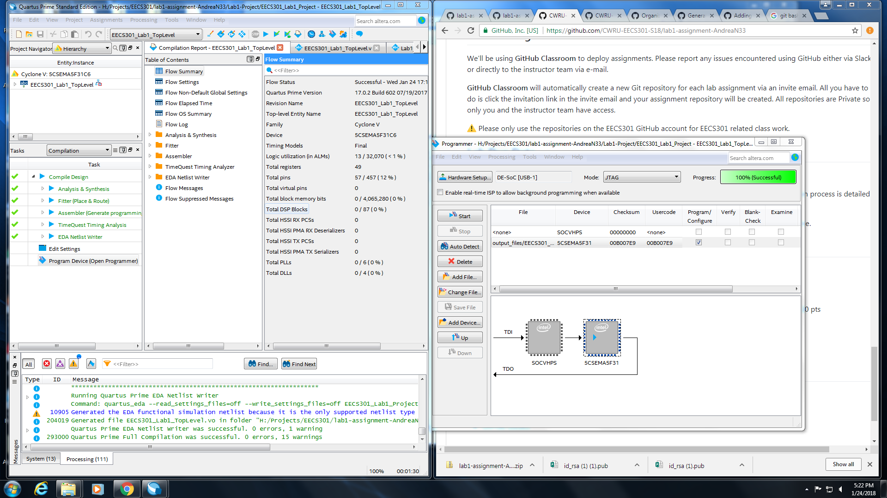

git@github.com:CWRU-EECS301-S18/lab1-assignment-AndreaN33.git# EECS301 Lab #1 Report

* **Andrea Norris** (adn33@case.edu)
* **Team #6**

## Introduction
In this project, I retrieved and uploaded code located on github to the FPGA chip of Altera Development
and Education Board. The uploaded code generated a series of letters and numbers corresponding to unique
button presses on the board. The intention of completing this was to learn how to interface with the 
GitHub browser via GitBash, learn how to debug common Quartus compiler errors, and practice using the 
ModelSim interface. The system's sole input was from button presses, and it output a series of numbers
and letters on the 7-Segment display.

## Implementation Details
This project was primarily for learning to use Quartus and ModelSim, so it's implementation is not 
complicated. The final program functions by summing the button pressed values and displaying the sum. 
Each button from right to left was assigned a numberical value, with the furthest right having a value
of one, and the others proceeding with values 2, 3, and 4. When the total value of the key presses was 4 
or higher, a "C" was displayed. If the total value was 7 or higher, an "A" was displayed in the next 
section. If the total value was 9 or higher, an "S" was displayed in the segment following "A". When the 
total value was 10, an "E" was displayed following the "S", spelling "CASE". The following table 
demonstrates this behavior
|Button 4|Button 3|Button 2| Button 1|Cell 1|Cell 2|Cell 3|Cell 4|Number|
|--------|--------|--------|---------|------|------|------|------|------|
|0|0|0|0| | | | |0|
|0|0|0|1| | | | |1|
|0|0|1|0| | | | |2|
|0|0|1|1| | | | |3|
|0|1|0|0| | | | |3|
|0|1|0|1|C| | | |4|
|0|1|1|0|C| | | |5|
|0|1|1|1|C| | | |6|
|1|0|0|0|C| | | |4|
|1|0|0|1|C| | | |5|
|1|0|1|0|C| | | |6|
|1|0|1|1|C|A| | |7|
|1|1|0|0|C|A| | |7|
|1|1|0|1|C|A| | |8|
|1|1|1|0|C|A|S| |9|
|1|1|1|1|C|A|S|E|10|

## Verification Results
The results of the lab were tested in a few ways. Since the primary function of the lab was to learn to debug 
and upload code, a successful upload and run as shown below is verification of this function. 

The waveform simulated in ModelSim also serves to verify the results gotten from this lab.

## Conclusions
In this lab I learned how to use GitBash effectively, troubleshoot GitHub cloning errors, and use Quartus
ModelSim. The various GitHub tutorials were especially beneficial in helping me understand the structure 
of Git and how the different console commands work. 

## Computer Usage Information & Time Spent
Completing this lab took 4.5 hours total troubleshooting with my lab partner and on my own. Actual lab 
work took about 4 hours additionally, for 8.5 hours work overall. The work was done solely on the Circuits 
Lab Computer.

## Difficulties / Issues
The primary issues encountered had to do with the GitBash interface and troubleshooting SSH key issues 
and commit message difficulties. 

